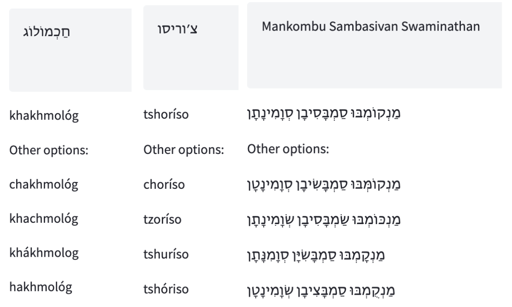
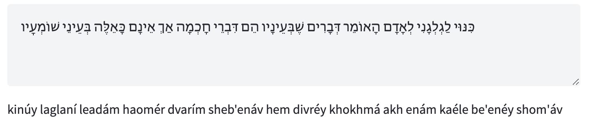

# TaatikNet: Converting between Hebrew text and Latin transliteration
## A simple demonstration of character-level seq2seq learning


Modern transformer networks are great for complex text-to-text tasks like machine translation, text summarization, paraphrasing and more. This repo shows a simple example of how to train a model given a dataset of paired examples, using a particularly interesting character-level task: **converting between Hebrew text and Latin transliteration**.

Please see the accompanying blog post (TBD) for more information.

## Dataset

The data in `data/he_transliterations.csv` contains nearly 15K Hebrew words along with nikkud (vowel symbols) and Latin transliterations. These were scraped from the [Hebrew Wiktionary](https://he.wiktionary.com/) in mid-2023. See the blog post for more details.

## Training

See the contents of the accompanying [Jupyter notebook](training.ipynb) for simple, annotated training code for TaatikNet. It is fine-tuned on our training dataset using the base model ByT5-small ([paper](https://arxiv.org/abs/2105.13626), [HF model page](https://huggingface.co/google/byt5-small)), a byte-level (tokenizer-free) encoder-decoder transformer model.

TaatikNet is trained to predict in both directions (Hebrew text ↔ Latin transliteration); additionally, vowel marks (in Hebrew) and stress accent marks (in transliteration) are sometimes randomly dropped in the input so the model learns to infer with or without them provided.

## Inference

Inference on single words is simple with the HF Transformers "text2text-generation" pipeline API:

```
from transformers import pipeline

pipe = pipeline("text2text-generation", model="malper/taatiknet")

pipe("kornel")[0]['generated_text']
# returns 'קוֹרְנֶל'

pipe("אולגוסטרביה", num_beams=10, num_return_sequences=10, max_length=100)
# returns [{'generated_text': 'olgostrávya'}, ...]
```

Note that long outputs are likely to be cut off unless you increase `max_length` from the default value.

If you want to use your own weights, replace `malper/taatiknet` with the model's location.

To run inference on multiple words, you are recommended to split the text by whitespace. You may also want to group words into minibatches, and to normalize the input text (NFC Unicode normalization and handling some special characters) to match the model's training. See [the HuggingFace Spaces demo code](https://huggingface.co/spaces/malper/taatiknet/blob/main/app.py) for a demonstration of these points.

## Examples

Check out some examples of inputs and outputs to the resulting model **TaatikNet**:




(This uses beam search with 5 beams; the first result is the top beam.)

You may play with this yourself at the [interactive demo](https://huggingface.co/spaces/malper/taatiknet) hosted by Hugging Face Spaces.
